# DeepVital

DeepVital is a reproducible methodological research pipeline for early prediction
of sustained hypotension from longitudinal ICU vital signs represented through
FHIR-compatible clinical resources.

> **Research use only.** DeepVital is not a medical device, clinical
> decision-support tool, validated diagnostic system, or deployment-ready
> platform. Its outputs must not be used for patient-care decisions.

## Current scientific status

The repository implements FHIR inspection and canonical extraction, ICU-period-
bounded hourly processing, leakage-aware temporal windowing and labeling,
conventional machine-learning baselines, transparent clinical benchmarks, and
patient-grouped nested cross-validation. All 100 patients in the MIMIC-IV Clinical
Database Demo on FHIR 2.1.0 are treated as development data. The current evidence
is internal validation only; the confirmatory test is pending, and no external or
prospective validation has been performed.

The prespecified Phase 3 incremental-value analysis is complete. The frozen
18-predictor L2 logistic candidate showed a small positive incremental AUPRC over
six-hour mean MAP, but the gain did not reach the prespecified `+0.020` development
relevance margin. Six-hour mean MAP is retained as the parsimonious development
strategy; neither strategy is clinically validated.

The canonical cohort contains 100 patients, 128 represented hospital admissions,
140 ICU stays, and 8,970 eligible prediction windows from 92 patients. It includes
1,774 positive windows (19.78%). These overlapping windows are not independent
clinical events.

## Clinical question and outcome

At each hourly prediction time \(t\), DeepVital asks whether information available
from \(t-11\) through \(t\) can identify sustained hypotension in \(t+1\) through
\(t+6\). The primary outcome requires observed hourly mean arterial pressure (MAP)
strictly below 65 mmHg for at least two consecutive future hours. MAP at \(t\) is a
predictor and is not part of the outcome. All six future MAP hours must be observed
for the current primary analysis; incomplete assessment excludes the window and
may select more intensively monitored periods.

## Architecture

```mermaid
flowchart LR
    A["MIMIC-IV demo FHIR resources"] --> B["Aggregate inspection"]
    B --> C["Canonical vital-sign extraction"]
    C --> D["Administrative ICU-period hourly grid"]
    D --> E["Bounded forward fill and missingness metadata"]
    E --> F["12-hour retrospective windows"]
    F --> G["Future-only six-hour outcome"]
    G --> H["Patient-grouped nested cross-validation"]
    H --> I["Aggregate development reports"]
    I -. "future frozen strategy" .-> J["Independent confirmatory test"]
```



Every grid and window is constructed within a single patient, hospital admission,
and ICU stay. Multiple measurements in the same variable-hour are aggregated by
the median. There is no backward fill or future-dependent interpolation. Forward
fill is limited to two hours and is accompanied by observation, missingness,
forward-fill, and time-since-last-observation fields.

## Data and physiological variables

The implemented FHIR extraction streams gzip-compressed NDJSON and reconstructs
Patient, hospital Encounter, ICU Encounter, and Observation relationships. The
canonical extraction retained 89,415 observations and preserves original values
and units alongside normalized values. Fahrenheit is converted to degrees Celsius
only through an explicit unit rule. Provisional physiological-range exclusions and
unsupported observations are counted in an aggregate quality report.

Eight variables are represented:

- heart rate;
- respiratory rate;
- systolic blood pressure;
- diastolic blood pressure;
- mean arterial pressure;
- peripheral oxygen saturation;
- temperature;
- oxygen flow.

The code mappings are configuration-controlled but do not constitute definitive
clinical ontology validation. Invasive, non-invasive, and alternate arterial
pressure sources are currently pooled within variable-hour medians without a
clinically validated source-priority rule. Oxygen flow is not treated as FiO2.

## Canonical and historical Phase 1B routes

Two cohort-building routes previously coexisted:

| Route | Hourly rows | Eligible windows | Positive windows | Interpretation |
| --- | ---: | ---: | ---: | --- |
| Historical observation-bounded route | 12,309 | 8,872 | 1,759 | Preserved legacy development evidence |
| Administrative ICU-bounds route | 12,502 | 8,970 | 1,774 | Current canonical cohort |

The administrative route is canonical because its time-at-risk grid is defined by
FHIR ICU Encounter periods rather than the first and last supported vital-sign
observations. The decision was based on clinical-time definition, relationship
validation, auditability, and reproducibility—not downstream performance.

## Internal validation

The current internal validation uses five outer and three inner folds grouped by
patient. All windows from a patient remain together. Each patient is assigned to
one outer fold, and each of the 8,970 eligible windows receives exactly one
out-of-fold prediction. Candidate and threshold selection occur only within inner
cross-validation. Applicable imputers and scalers are fitted only on the relevant
training fold.

Conventional candidates include logistic regression, Gaussian Naive Bayes, and
Histogram Gradient Boosting. The nested strategy evaluates prespecified variants
of their regularization, variance-smoothing, or learning-rate parameters. The
clinical comparators are training-fold prevalence, last MAP, six-hour mean and
minimum MAP, MAP slope, shock index, and modified shock index.

The MAP- and shock-index-derived outputs are bounded ranking scores, not calibrated
probabilities. AUROC, AUPRC, and threshold-based metrics are applicable to these
scores; Brier score and log loss are not. The prevalence and nested-ML outputs are
probability estimates, although no post-hoc calibration model has been fitted.

## Current internal-development results

| Strategy | AUROC (95% patient-bootstrap CI) | AUPRC (95% CI) | Brier score | Log loss |
| --- | --- | --- | ---: | ---: |
| Six-hour mean MAP | 0.8416 (0.7984–0.8809) | 0.6219 (0.4914–0.7210) | Not applicable | Not applicable |
| Last MAP | 0.8216 (0.7856–0.8559) | 0.5613 (0.4464–0.6538) | Not applicable | Not applicable |
| Nested ML strategy | 0.8185 (0.7747–0.8633) | 0.5333 (0.4226–0.6423) | 0.1354 | 0.4228 |

In paired patient-level bootstrap comparisons, six-hour mean MAP minus the nested
ML strategy was 0.0231 for AUROC (95% interval 0.0010–0.0419) and 0.0886 for AUPRC
(0.0205–0.1453). Thus, in this internal development analysis, the six-hour mean
MAP benchmark showed higher discrimination than the tested multivariable strategy.
This does not establish clinical superiority, generalizability, or a final model.

When a benchmark cannot be computed, the predeclared primary rule assigns a neutral
score of 0.5 and reports availability and complete-case sensitivity. Nine windows
from nine patients were affected for last MAP and modified shock index; eight
windows from eight patients were affected for shock index. The two six-hour MAP
summaries and MAP slope were calculable for all eligible windows.

All uncertainty intervals use 1,000 patient-cluster bootstrap replicates. Patients,
not windows, are resampled, and all windows for a sampled patient remain together.
Each outer fold retains the threshold selected from its inner folds. Results at a
threshold of 0.5 are descriptive. This earlier broad nested comparison informed the
later frozen Phase 3 analysis; it was not itself the final strategy decision.

## Phase 3 incremental-value result

Phase 3 used the same 92 patients and 8,970 windows with five outer and three inner
patient-grouped folds, zero patient overlap, and one outer OOF prediction per
window. There was one formal preregistered development execution and no rerun after
results were observed.

| Strategy | AUROC | AUPRC |
| --- | ---: | ---: |
| Six-hour mean MAP | 0.8416282800 | 0.6218694691 |
| Frozen 18-predictor L2 logistic candidate | 0.8447827084 | 0.6293981556 |

Primary delta AUPRC was `+0.0075286864` (paired patient-bootstrap 95% interval
`+0.0004996287` to `+0.0171297719`). The positive gain did not reach the
prespecified `+0.020` development relevance margin, so the logistic candidate did
not advance and `map_mean_6h` remains the parsimonious development strategy. The
margin is not a p-value or a clinically validated minimal important difference.

The two incomplete-future-MAP sensitivities failed because their datasets contained
patients absent from the frozen fold manifest. The failure was disclosed, did not
alter the primary decision, and did not trigger a rerun.

## Historical development holdout

The earlier 8,872-window experiment is retained as `development_holdout_v1`, with
`evaluation_role: development`, `confirmatory_holdout: false`, and
`test_evaluation_count: 4`. Its metrics are preserved for audit continuity, but the
partition is not an untouched confirmatory holdout. The access count has not been
reset, and Git history does not support reconstructing every individual access with
complete certainty. See [the holdout reuse assessment](docs/HOLDOUT_REUSE_ASSESSMENT.md).

## Confirmatory evaluation status

`confirmatory_test_pending` remains the current state. A future confirmatory test
requires entirely new patients, a frozen protocol, cohort fingerprint, serialized
model and model hash, fixed feature schema, and frozen threshold. The implemented
confirmatory evaluator is inference-only, checks development-patient overlap, and
records first consumption and exact technical reproductions. It has not been run.

## Repository and documentation

```text
configs/            Versioned data, outcome, model, and evaluation settings
docs/               Current protocols, methods, governance, and historical records
scripts/            Explicit pipeline entry points
src/deepvital/      Reusable extraction, cohort, feature, model, and evaluation code
tests/              Synthetic and methodological tests
reports/            Versioned aggregate reports; no patient-level prediction rows
```

The documentation entry point is [docs/README.md](docs/README.md). Current-state
summaries are in [PROJECT_STATUS.md](docs/PROJECT_STATUS.md),
[RESEARCH_PROTOCOL.md](docs/RESEARCH_PROTOCOL.md),
[METHODS_CURRENT.md](docs/METHODS_CURRENT.md), and
[RESULTS_CURRENT.md](docs/RESULTS_CURRENT.md).

## Installation and software verification

Python 3.12 is the CI reference version.

```bash
python3.12 -m venv .venv
source .venv/bin/activate
python -m pip install -r requirements-dev.txt
make check
```

Phase 3 implementation and results passed repository CI before merge through PR #5.
Runtime dependencies are not fully pinned, so exact environment reproduction
continues to require recorded package metadata and matching private inputs.

The public synthetic demonstration can be run with `make demo`. It does not
reproduce the clinical experiment or provide clinical evidence.

## Reproducing authorized-data stages

The following commands require authorized local data. They must not be run merely
to verify installation, and their paths and outputs must be reviewed before use.

```bash
python scripts/extract_canonical_vitals.py \
  --fhir-dir data/mimic-iv-clinical-database-demo-on-fhir-2.1.0/fhir \
  --output data/processed/canonical_vitals.csv \
  --quality-report reports/canonical_extraction_quality.json \
  --format csv

python scripts/build_canonical_cohort.py \
  --canonical-input data/processed/canonical_vitals.csv \
  --fhir-dir data/mimic-iv-clinical-database-demo-on-fhir-2.1.0/fhir \
  --require-clean-worktree
```

Patient-level raw, interim, and processed products are ignored by Git. The public
repository contains aggregate reports and fingerprints only. MIMIC-IV access and
redistribution conditions continue to apply.

## Development workflow and CI

```text
feature branch → local tests → Ruff → git diff --check → push
→ pull request → GitHub Actions → review → merge into main
```

GitHub Actions runs on pushes and pull requests using Python 3.12, installs
`requirements-dev.txt`, executes `python -m ruff check .`, and then executes
`python -m pytest -q`. These checks validate software contracts; they do not
recompute or validate clinical results.

## Principal limitations

- The source is a 100-patient demonstration dataset; only 92 patients contribute
  eligible windows.
- Evidence is internal development evidence, not confirmatory or external
  validation.
- Patients contribute correlated, overlapping windows; clustered inference does
  not create additional independent patients.
- Complete future MAP ascertainment may introduce selection bias.
- Missingness may be clinically and operationally informative.
- Blood-pressure source pooling lacks a validated source-precedence analysis.
- The `+0.020` margin was a prespecified development relevance rule, not a
  clinically validated effect threshold.
- Two incomplete-future-MAP sensitivities failed because their datasets contained
  patients absent from the frozen fold manifest.
- Logistic calibration and operating points are development outputs only; they are
  not validated clinical thresholds.
- No transportability, decision-curve, workflow, prospective alerting, impact, or
  clinical-benefit evaluation has been completed.
- Future restricted confirmatory or external datasets may require additional
  approvals and governance controls.

## License, ethics, and data use

No project-level `LICENSE` file is currently present. Ethics and data-use
statements should be finalized according to the requirements of the underlying
dataset and the intended venue. No institutional approval or affiliation is
asserted by this repository.
