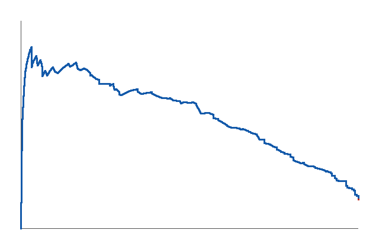
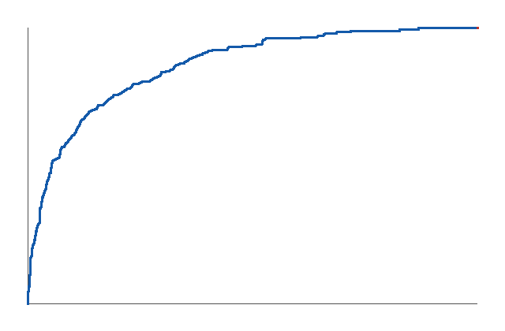
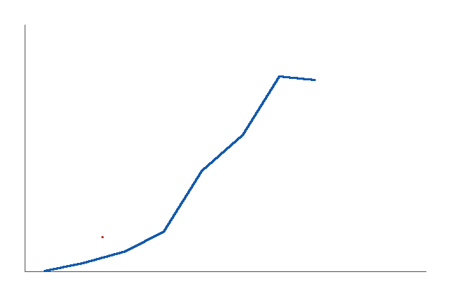

# DeepVital

**A research prototype for early prediction of sustained hypotension in intensive
care using longitudinal vital signs.**

> **Research use only.** DeepVital is not a medical device, has not undergone
> clinical validation, and must not be used for diagnosis, treatment, monitoring,
> triage, or other patient-care decisions.

## Overview

Sustained hypotension is a clinically important pattern in intensive care, but
retrospective prediction is methodologically difficult: measurements are irregular,
missingness is informative, multiple observations belong to the same patient, and
future information can easily leak into predictors. DeepVital addresses these
engineering and evaluation problems in a small research setting. It asks whether
the previous 12 hours of routinely charted vital signs can identify windows followed
by sustained hypotension during the next 6 hours.

The current implementation uses the MIMIC-IV Clinical Database Demo on FHIR 2.1.0.
It combines FHIR resource inspection, clinical data normalization, ICU-stay-aware
temporal aggregation, explicit missing-data representations, future-only labeling,
patient-level data splitting, transparent clinical benchmarks, and conventional
machine-learning baselines. The available results are an internal developmental
evaluation on a small demo cohort. They do not establish clinical effectiveness or
generalizability.

## Clinical question

At an hourly prediction time \(t\), can measurements available from \(t-11\)
through \(t\) predict sustained hypotension in \(t+1\) through \(t+6\)?

The primary outcome is:

- mean arterial pressure (MAP) strictly below 65 mmHg;
- for at least two consecutive hourly observations;
- within the six hours after the prediction time.

MAP at \(t\) is a predictor, not part of the future label. The label uses real
hourly MAP aggregates only; forward-filled MAP is not accepted as outcome evidence.
A primary-analysis window is excluded when any of the six future MAP hours required
for outcome assessment is missing. Predictors contain only information available at
or before \(t\).

## Project pipeline

```mermaid
flowchart LR
    A["MIMIC-IV demo FHIR resources"] --> B["Aggregate-only FHIR inventory"]
    B --> C["Canonical ICU vital signs"]
    C --> D["ICU-bounded hourly aggregation"]
    D --> E["Bounded forward fill and missingness representation"]
    E --> F["12-hour trailing patient windows"]
    F --> G["Future-only sustained-hypotension labels"]
    G --> H["Patient-level train / validation / developmental holdout split"]
    H --> I["Clinical benchmarks and baseline model training"]
    I --> J["Validation-only model and threshold selection"]
    J --> K["Developmental holdout evaluation"]
    K --> L["Aggregate metrics, patient bootstrap, and figures"]
```



Every hourly grid and window is constructed within one `subject_id`, `hadm_id`,
and `stay_id`. The public repository is intended to contain aggregate reports, not
patient-level rows or split assignments.

## Dataset and cohort

The audited modeling build contains:

| Partition | Assigned patients | Patients with windows | Windows | Event prevalence |
| --- | ---: | ---: | ---: | ---: |
| Training | 70 | 63 | 5,636 | 19.30% |
| Validation | 15 | 14 | 1,685 | 26.82% |
| Developmental holdout | 15 | 15 | 1,551 | 14.12% |
| **Total** | **100** | **92** | **8,872** | **19.83% overall** |

The build begins from 89,415 supported canonical observations representing 100
patients, 128 hospital admissions, and 140 ICU stays. Hourly processing produced
12,309 rows. It identified 10,008 candidate windows, excluded 1,136 for incomplete
future MAP assessment, and retained 8,872 labeled windows: 1,759 positive and 7,113
negative.

Splitting is deterministic and performed by patient. All admissions, ICU stays, and
windows from the same patient remain in one partition. Patients assigned to a split
but contributing no eligible window remain distinguishable in aggregate reporting.

These are overlapping prediction windows, not independent clinical events.

## Features

The baseline modeling table exposes 140 prespecified current and trailing features
derived from heart rate, respiratory rate, systolic and diastolic blood pressure,
MAP, oxygen saturation, temperature, and oxygen flow. Feature families include:

- current and previous values;
- one-hour changes;
- rolling means, medians, minima, maxima, and standard deviations;
- temporal slopes;
- observed-measurement counts and missing proportions;
- current observation, missingness, and bounded-forward-fill indicators;
- time since the last real measurement;
- pulse pressure and shock index with explicit missing indicators.

Forward filling is limited to two hours and never crosses an ICU stay. There is no
backward filling. Oxygen flow is not treated as equivalent to FiO2. Patient,
admission, stay, and window identifiers are excluded from predictors, as are the
label, split, prediction timestamp, and future variables.

## Models and clinical benchmarks

DeepVital compares conventional classifiers with deliberately simple clinical
references:

- a dummy classifier based on training prevalence;
- logistic regression with median imputation, standardization, and class weighting;
- Gaussian Naive Bayes with median imputation and standardization;
- scikit-learn Histogram Gradient Boosting;
- transparent MAP benchmarks based on current, previous, minimum, mean, change,
  slope, and fixed thresholds;
- shock index and modified shock index benchmarks.

Applicable imputers and scalers are contained in pipelines fitted on training data.
Histogram Gradient Boosting handles missing values natively. No post-hoc calibration
model was fitted.

The selected model is the transparent `map_mean_6h` benchmark: a risk score derived
from the mean MAP over the trailing six hours. Selection used the highest validation
AUPRC, then the lowest validation Brier score, then model name as a deterministic
final tie-break. The selection of a simple benchmark is a useful result in itself;
model complexity is not assumed to imply better performance.

## Results

The table reports the selected benchmark at its validation-selected Youden
threshold of 0.3775406688. Values are copied from the existing aggregate reports;
they were not recalculated for this README.

| Partition | AUROC | AUPRC | Brier score | Sensitivity | Specificity | PPV | NPV | F1 |
| --- | ---: | ---: | ---: | ---: | ---: | ---: | ---: | ---: |
| Validation | 0.7897 | 0.6124 | 0.1622 | 0.7389 | 0.7486 | 0.5186 | 0.8866 | 0.6095 |
| Developmental holdout | 0.8649 | 0.5490 | 0.1024 | 0.6849 | 0.8686 | 0.4615 | 0.9437 | 0.5515 |

For the developmental holdout, patient-cluster bootstrap yielded 95% percentile
intervals of 0.6987–0.9554 for AUROC, 0.1739–0.7875 for AUPRC, and
0.0621–0.1461 for Brier score. All 1,000 requested replicates were valid. These
wide intervals reflect the small number of patients and should temper comparisons
between models.

> The developmental holdout was processed during pipeline and metric corrections
> and should not be interpreted as a completely independent confirmatory
> evaluation.

The selection record reports four accesses to this partition. The selected model
and validation-derived thresholds did not change, but the reuse is a protocol
deviation. Consequently, these results are best understood as internal development
evidence, not as a final performance claim.

## Evaluation safeguards

Implemented safeguards include:

- patient-level splitting with zero patient overlap;
- ICU-stay-bounded aggregation and window construction;
- predictors ending at \(t\) and outcomes beginning at \(t+1\);
- future labels based on observed, not forward-filled, MAP;
- training-only fitting of model parameters, imputers, and scalers;
- model selection using validation metrics only;
- Youden and target-sensitivity thresholds selected on validation only;
- deterministic seeds for splitting, models, and bootstrap;
- patient-cluster bootstrap that resamples patients with replacement and retains
  all windows for every sampled patient;
- aggregate reports without patient, admission, stay, window, or prediction-time
  identifiers.

These controls reduce common leakage and dependence errors, but they do not replace
evaluation on larger and independently defined cohorts.

## Figures

The current figures are compact aggregate plots generated from the developmental
evaluation. Exact numerical values are available in `reports/`; the plots should
not be interpreted without the accompanying protocol and limitations.

### Precision–recall curve



### ROC curve



### Calibration curve



Additional artifacts include
[`decision_thresholds.png`](reports/figures/decision_thresholds.png) and
[`risk_distribution.png`](reports/figures/risk_distribution.png).

## Repository structure

```text
configs/            Data, labeling, splitting, modeling, and evaluation settings
docs/               Protocols, audits, data definitions, and model documentation
scripts/            Inspection, extraction, dataset construction, training, evaluation
src/deepvital/      Reusable clinical data, feature, model, and evaluation modules
tests/              Synthetic fixtures and methodological unit tests
reports/            Aggregate quality, cohort, metric, and comparison artifacts
models/             Local serialized baselines and model-selection metadata
```

Patient-level local artifacts under `data/processed/` and serialized `.joblib`
models are ignored by Git.

## Installation

The repository currently uses a requirements file rather than an installable Python
package. A local virtual environment can be prepared with:

```bash
python -m venv .venv
source .venv/bin/activate
python -m pip install --upgrade pip
python -m pip install -r requirements.txt
```

`requirements.txt` currently names major runtime dependencies but does not pin their
versions completely. Reproducing the exact development environment therefore
requires additional environment capture. PostgreSQL access is optional for legacy
local exploration and must be configured through `DEEPVITAL_DATABASE_URL`; secrets
must not be committed.

## Testing

The automated suite uses synthetic resources, fixtures, and temporary paths:

```bash
python -m pytest -q
python -m ruff check .
```

At the current repository state, 53 tests pass, including 18 Phase 2 tests covering
feature exclusion, clinical benchmarks, probability metrics, validation-only
selection behavior, threshold reuse, patient-level bootstrap, deterministic seeds,
calibration summaries, and aggregate report schemas.

Passing unit tests demonstrate the tested software contracts. They do not reproduce
model training, establish clinical validity, or provide new evaluation evidence.

## Reproducing the pipeline

The full numerical results require authorized local access to the MIMIC-IV demo
resources and private intermediate files. MIMIC data are not redistributed by this
repository. The commands below document the implemented order; paths should be
reviewed before use.

### 1. Aggregate FHIR inspection

```bash
python scripts/inspect_fhir.py \
  data/mimic-iv-clinical-database-demo-on-fhir-2.1.0/fhir \
  --output-dir reports
```

### 2. Canonical extraction

```bash
python scripts/extract_canonical_vitals.py \
  --fhir-dir data/mimic-iv-clinical-database-demo-on-fhir-2.1.0/fhir \
  --output data/processed/canonical_vitals.csv \
  --quality-report reports/canonical_extraction_quality.json \
  --format csv
```

### 3. ICU-bounded hourly and modeling datasets

```bash
python scripts/build_hourly_dataset.py \
  --canonical-input data/processed/canonical_vitals.csv \
  --fhir-dir data/mimic-iv-clinical-database-demo-on-fhir-2.1.0/fhir \
  --output data/processed/hourly_vitals.csv \
  --quality-report reports/hourly_quality.json

python scripts/build_modeling_dataset.py \
  --hourly-input data/processed/hourly_vitals.csv \
  --output data/processed/modeling_windows.csv \
  --split-manifest data/processed/split_manifest.json \
  --report-dir reports
```

The repository also contains a legacy combined Phase 1B builder. The separate
ICU-period-bounded path above better expresses the implemented administrative-bound
workflow; historical documentation records a second build path with different
aggregate counts.

### 4. Baseline training and validation selection

```bash
python scripts/train_baseline_models.py
```

This command fits models on training data, produces validation predictions, selects
the model and thresholds, writes validation reports, and updates local model
artifacts.

### 5. Developmental holdout evaluation

> **The evaluation command accesses the developmental holdout and should not be
> rerun casually.** It also overwrites aggregate evaluation artifacts and increments
> the access count in the model-selection record.

```bash
python scripts/evaluate_baseline_models.py
```

Do not run this command merely to verify installation. Use the synthetic pytest
suite for software verification.

## Limitations

- The project uses a 100-patient MIMIC-IV-on-FHIR demo, with only 92 patients
  contributing eligible windows.
- Split prevalence differs materially: 19.30% in training, 26.82% in validation,
  and 14.12% in the developmental holdout.
- Overlapping windows from the same patient are correlated. Patient-level splitting,
  equal-patient weighting, and clustered bootstrap address parts of this dependence
  but do not create additional independent patients.
- The developmental holdout was processed four times during pipeline and metric
  corrections. It is not a fully independent confirmatory assessment.
- No external validation dataset has been evaluated.
- No prospective or clinical validation has been performed.
- No post-hoc calibration model was fitted. Reported calibration intercepts,
  slopes, curves, and Brier scores are descriptive.
- Requiring complete future MAP may select periods with more intensive monitoring.
- Invasive and non-invasive blood-pressure sources are pooled by hourly median
  without a clinically validated source-priority rule.
- Oxygen flow is not FiO2 and is not a validated NEWS2 oxygen variable.
- The small, non-stratified patient split produces unstable estimates and wide
  patient-bootstrap intervals.
- The available results are not generalizable to other hospitals, populations,
  devices, charting practices, or prospective workflows.

## Intended use

DeepVital is an educational and research software project demonstrating clinical
data engineering, FHIR processing, temporal cohort construction, leakage-aware
machine learning, and transparent evaluation. It is not intended to generate
patient-facing alerts or support direct clinical decisions. Any future progression
toward silent testing or workflow integration would require governance review,
independent data, prospective protocols, usability and safety assessment, and
appropriate regulatory analysis.

## Current status

| Phase | Status |
| --- | --- |
| FHIR inventory and audit | Complete |
| Canonical extraction | Complete |
| Windowing and labeling | Complete |
| Clinical and ML baselines | Complete as developmental evaluation |
| Patient-grouped nested cross-validation | Planned |
| External validation | Not available |
| Temporal deep learning model | Not started |

## Author

The repository does not currently provide a verified author name. As a physician
and information-technology engineer, I designed DeepVital around a question that is
clinically understandable and technically auditable. No institutional endorsement
or clinical deployment experience is implied.

## License and data

No project-level `LICENSE` file is currently present; selecting and documenting a
software license remains pending.

MIMIC-IV and MIMIC-IV-on-FHIR data remain subject to their own access, credentialing,
and use conditions. Raw and processed clinical data are stored locally, excluded
from version control, and must not be redistributed through this repository. Public
examples and automated tests use synthetic data.
