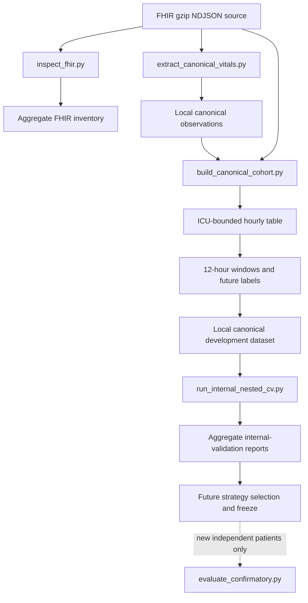

# DeepVital software and data architecture

## System boundary

DeepVital is a file-oriented retrospective research pipeline. Public software tests
use synthetic fixtures. Authorized clinical inputs and patient-level derivatives
remain local; only aggregate reports and fingerprints cross the public boundary.

## FHIR inspection and extraction

- `src/deepvital/fhir/reader.py` streams compressed resources.
- `scripts/inspect_fhir.py` creates aggregate inventory reports.
- `src/deepvital/cohort/encounters.py` resolves Patient and Encounter relationships.
- `src/deepvital/fhir/extraction.py` maps supported Observations, converts units,
  applies plausibility checks, and constructs canonical rows.
- `scripts/extract_canonical_vitals.py` is the extraction entry point.

Configuration is held in `configs/fhir_vital_signs.yaml` and
`configs/unit_conversions.yaml`. Identifier-bearing output is private.

## Canonical cohort construction

- `src/deepvital/cohort/hourly_dataset.py` validates ICU periods, constructs hourly
  grids, aggregates medians, and represents missingness.
- `src/deepvital/windows/builder.py` constructs retrospective windows, derives
  features, labels future sustained hypotension, and applies patient-level splits.
- `scripts/build_canonical_cohort.py` orchestrates both stages and writes aggregate
  provenance metadata.

The deprecated `scripts/build_phase_1b_dataset.py` remains only for historical
reproduction and requires explicit acknowledgement.

## Modeling and internal validation

- `src/deepvital/models/pipelines.py` selects prespecified predictors and excludes
  identifiers, timestamps, splits, labels, and future fields.
- `src/deepvital/models/baseline_models.py` creates conventional estimator
  pipelines.
- `src/deepvital/models/clinical_baselines.py` computes transparent benchmark
  scores and availability.
- `src/deepvital/evaluation/nested_cv.py` performs grouped outer/inner validation,
  selection, OOF accounting, threshold separation, and report assembly.
- `src/deepvital/evaluation/bootstrap.py` implements patient-cluster and paired
  bootstrap inference.
- `scripts/run_internal_nested_cv.py` supplies canonical rows and writes only
  aggregate comparison artifacts.

## Confirmatory boundary

`src/deepvital/evaluation/confirmatory.py` is an inference-only future boundary.
It verifies frozen artifacts and fingerprints, checks development-patient overlap,
and manages first consumption versus technical reproduction. The CLI wrapper is
`scripts/evaluate_confirmatory.py`. It must not be invoked without independent
patients and a frozen protocol. No confirmatory result currently exists.

## Reproducibility and quality controls

`src/deepvital/reproducibility/fingerprints.py` implements deterministic SHA-256
fingerprints and public-metadata privacy checks. Tests use temporary and synthetic
data. GitHub Actions installs development dependencies under Python 3.12 and runs
Ruff and pytest. CI verifies software contracts but does not regenerate clinical
reports or validate clinical performance.
