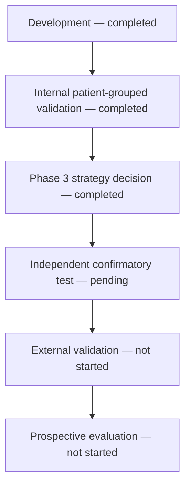

# Validation strategy

## Development — completed

The 100-patient MIMIC-IV-on-FHIR demo supports pipeline construction, feature and
outcome specification, conventional candidates, clinical benchmarks, and
historical development analyses. The former holdout is reclassified as development
evidence following four accesses.

## Internal patient-grouped validation — completed

Five-by-three nested cross-validation provides one out-of-fold prediction per
eligible window, with patients grouped across all folds. Results quantify internal
development performance and paired benchmark differences. They do not provide an
independent estimate of generalizability.

## Phase 3 strategy decision — completed

The single formal preregistered Phase 3 execution compared six-hour mean MAP with
the frozen 18-predictor L2 logistic candidate. Delta AUPRC was `+0.0075286864`,
below the prespecified `+0.020` development relevance margin. The candidate did not
advance, and `map_mean_6h` remains the parsimonious development strategy. This is an
internal development decision, not clinical validation.

The next evidence stage should seek independent patients and evaluate
transportability and calibration. Additional model shopping on the same cohort is
not the next milestone.

## Independent confirmatory test — pending

The confirmatory cohort must contain entirely new patients. Protocol, cohort,
features, model, threshold, and fingerprints must be frozen before access. The
inference-only evaluator is implemented but has not been executed.

## External validation — not started

External validation requires an independently sourced setting and assessment of
transportability across population, institution, devices, workflow, and charting
practice. A confirmatory split and external validation are not synonymous.

## Prospective evaluation — not started

Prospective work would require governance, ethics, privacy, interoperability,
usability, alert-burden, safety, workflow, and clinical-impact planning. No live or
silent prospective evaluation is currently justified by the available evidence.
